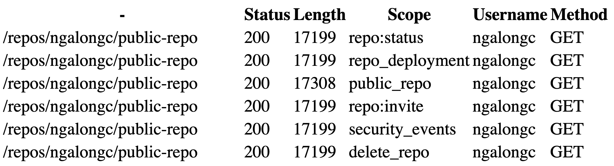

<h1 align="center">OpenAPI Security Scanner</h1> 

## About The Project

Authorization security issues in modern web applications could not be easily picked up by security scanners. A few examples from [Shopify](https://hackerone.com/reports/980511), [LINE](https://hackerone.com/reports/698579), [NordVPN](https://hackerone.com/reports/751577). 
One of the reasons is that the security scanners mainly looking for SQLi, XSS, RCE instead of looking for authorization security bugs, and the scanners usually do not have knowledge of how the web application is supposed to behave. That's why the majority of the authorization bugs now are mainly discovered manually.
OpenAPI Security Scanner is created to help to discover authorization security issues with both automation and manual review. It behaves like an external unit test tool to make sure everything is behaving the way it should be.

### Built With

* [Schemathesis](https://github.com/schemathesis/schemathesis)

<!-- GETTING STARTED -->
## Getting Started

Watch this [video](https://youtu.be/K65e5QRQ1tc) to follow along or keep reading.

[Fork](https://gitlab.com/ngalog-gitlab/openapi_security_scanner/-/forks/new) or clone this project and follow the instructions below to get started.

The workflow to use this scanner would look something like this:

- Prepare the OpenAPI yaml file of the targeted API
- Define the targeted endpoints and variables to be used for the API testing
- Generate multiple sets of credentials from different users to make sure a variety of edge cases are covered while performing the API tests
- After the configuration, start the runner and the scanning result could be found in the artifacts
- Schedule the runner to run periodically and customize the way you want to receive the notifications whenever there's a change in the scanning result

### Advantages
For developers, using this tool would add an extra layer of assurance that the API is behaving as expected from both internally and externally. And the scanner could be triggered upon every code deployment by triggering the pipeline https://docs.gitlab.com/ee/ci/triggers/.

For bug bounty hunters, using this tool can ensure you can always stay on top of the targeted API, because we all know, even a specific endpoint wasn't vulnerable before, it could be vulnerable in the future because of various reasons. So it's easier to have the manual part of bug hunting to be automated using this tool.

## Warning Before Use
Make sure you have the permission to scan the targeted API.

### Prerequisites

You'll need an OpenAPI yaml file of the web application and replace it with the content of `api.yaml` in the repository.

<!-- USAGE EXAMPLES -->
## Usage

Replace the content of `api.yaml` by target's OpenAPI yaml file, and go to GitLab project's `Settings` -> `CI/CD` -> Expand `Variables` and enter the variables in below formats.


#### OPENAPI_CREDS 

The credentials provided here will be passed to the API calls in the form of `Authorization: Bearer` header format.
It is recommended to prepare access tokens for at least two user accounts with different permissions, and you can also create more than one access token per user account to test for correct behaviours for different scoped access tokens.

```json
{
   "<user_a>":[
      {
         "scope":"<scope>",
         "access_token":"<value>",
         "name":"<name_of_access_token>"
      },
      {
         "scope":"<scope>",
         "access_token":"<value>",
         "name":"<name_of_access_token>"
      }
   ],
   "<user_b>":[
      {
         "scope":"<scope>",
         "access_token":"<value>",
         "name":"<name_of_access_token>"
      }
   ]
}
```

#### OPENAPI_ENDPOINTS

The endpoints provided here should be `GET` based API calls, and you can also include the query in the JSON body. In below example, the endpoint is `/org/{orgs}/repos` and the query for it is `type=all`. For the endpoint `/repos/{owner}/{repo}`, there'll be no query.

```json
{
   "/orgs/{org}/repos":{
      "type":"all"
   },
   "/repos/{owner}/{repo}":{
      
   }
}
```

#### OPENAPI_PATHS

The path variables can be provided here, and the scanner will generate all combinations from values in the path variables.

```json
{
   "org":[
      "test-org"
   ],
   "owner":[
      "ngalongc",
      "reconless"
   ],
   "repo":[
      "public-repo",
      "private-repo"
   ]
}
```

In this case, the following combination API calls are generated, and they will all be called by different set of credentials provided in OPENAPI_CREDS.

```http
/orgs/test-org/repos?type=all
/repos/ngalongc/public-repo
/repos/ngalongc/private-repo
/repos/reconless/public-repo
/repos/reconless/private-repo
```

#### PRIVATE_TOKEN

Go to https://gitlab.com/-/profile/personal_access_tokens and create an `api` access token and replace the value in here. This GitLab access token is used for downloading the scan results from GitLab runner.

```
<YOU_GITLAB_API_ACCESS_TOKEN>
```

#### OPENAPI_BASE_URL

This should be the value of the base url of your API server

```
https://example.com/api/v3
```

### Demo Running simple permission tests on GitHub API

*Screenshot of the slack notification when API changes are detected*


*Screenshot of the scanning result in artifacts*



Sample report: https://ngalog-gitlab.gitlab.io/-/openapi_security_scanner/-/jobs/966841401/artifacts/sample.html

## Limitations
- It can only test for `GET` based endpoints
- For some API endpoints such as `/users/{user_id}/activities`, the responses are different everytime they are called, so detecting the changes of this kind of API is not meaningful


<!-- CONTRIBUTING -->
## Contributing

Contributions are what make the open source community such an amazing place to be learn, inspire, and create. Any contributions you make are **greatly appreciated**.

1. Fork the Project
2. Create your Feature Branch (`git checkout -b feature/AmazingFeature`)
3. Commit your Changes (`git commit -m 'Add some AmazingFeature'`)
4. Push to the Branch (`git push origin feature/AmazingFeature`)
5. Open a Merge Request

<!-- LICENSE -->
## License

Distributed under the MIT License. See `LICENSE` for more information.

<!-- CONTACT -->
## Contact

Ron Chan - [@ngalongc](https://twitter.com/ngalongc)

Project Link: [https://gitlab.com/ngalog-gitlab/openapi_security_scanner](https://gitlab.com.com/ngalog-gitlab/openapi_security_scanner)


